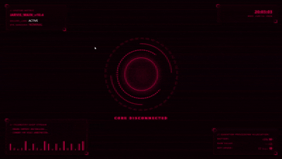

# 🚀 GeniusNIA

> A next-generation AI assistant built to understand, assist, automate, and evolve.

GeniusNIA is a futuristic personal AI assistant designed for voice interaction, intelligent automation, real-time system monitoring, and immersive human-computer interaction. It combines a modern HUD interface with powerful backend capabilities to create a truly interactive AI experience.


---

## ✨ Features

### 🎙️ Voice Interaction
- Wake word detection
- Speech-to-text processing
- Natural language conversation
- Real-time voice responses

### 🧠 Intelligent Assistance
- Answer questions
- Perform web searches
- Open applications
- Execute system commands
- Generate content

### 🎨 Futuristic HUD Interface
- Cyberpunk-inspired design
- Real-time status updates
- Animated AI core
- Listening, Thinking, and Talking states
- Interactive visual effects

### 📊 System Monitoring
- Battery monitoring
- Network speed monitoring
- Live telemetry display
- System status indicators

### ⚡ Automation
- Application control
- Task automation
- Workflow execution
- Custom command support

---

## 🛠️ Technologies Used

- Python
- HTML5
- CSS3
- JavaScript
- WebSocket
- Speech Recognition
- Text-to-Speech (TTS)

---

## 🎯 Current Capabilities

- Real-time AI HUD
- Voice interaction states
- Animated reactor core visualization
- Battery status monitoring
- Network telemetry
- WebSocket communication

---

## 🔮 Planned Features

- AI Memory System
- Vision & Object Detection
- Face Recognition
- Emotion Detection
- Smart Home Integration
- IoT Device Control
- Plugin System
- Multi-language Support
- Advanced Automation Engine
- Mobile Companion App
- Offline AI Mode
- Personal Knowledge Base

---

## 🚀 Getting Started

### Clone the Repository

```bash
git clone https://github.com/yourusername/GeniusNIA.git
cd GeniusNIA
```

### Run the Project

```bash
python main.py
```

Then open:

```text
http://localhost
```

---

## 🎯 Vision

GeniusNIA is not just another assistant.

The goal is to build a personal AI companion capable of understanding users, automating daily tasks, interacting naturally through voice, controlling devices, and continuously evolving through new capabilities.

---

## 🤝 Contributing

Contributions, suggestions, and feature requests are welcome.

Feel free to fork the project and submit pull requests.

---

## ✍ Author

Made with  by Papia

---

## 📜 License

This project is licensed under the MIT License.

---

# "Intelligence Meets Innovation."
### — GeniusNIA
